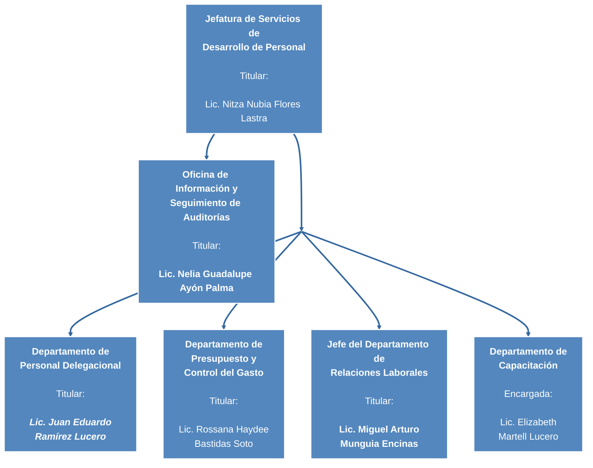

# Organigrama del IMSS

```mermaid
flowchart TB
    J["<b>Jefatura de Servicios de<br/>Desarrollo de Personal</b><br/><br/>Titular:<br/><br/>Lic. Nitza Nubia Flores Lastra"]
    O["<b>Oficina de Información y<br/>Seguimiento de Auditorías</b><br/><br/>Titular:<br/><br/><b>Lic. Nelia Guadalupe Ayón Palma</b>"]
    C[" "]
    D1["<b>Departamento de<br/>Personal Delegacional</b><br/><br/>Titular:<br/><br/><i><b>Lic. Juan Eduardo<br/>Ramírez Lucero</b></i>"]
    D2["<b>Departamento de<br/>Presupuesto y<br/>Control del Gasto</b><br/><br/>Titular:<br/><br/>Lic. Rossana Haydee<br/>Bastidas Soto"]
    D3["<b>Jefe del Departamento de<br/>Relaciones Laborales</b><br/><br/>Titular:<br/><br/><b>Lic. Miguel Arturo<br/>Munguia Encinas</b>"]
    D4["<b>Departamento de<br/>Capacitación</b><br/><br/>Encargada:<br/><br/>Lic. Elizabeth<br/>Martell Lucero"]

    J --> O
    J --> C
    C --> D1
    C --> D2
    C --> D3
    C --> D4

    classDef puesto fill:#5487be,stroke:#ffffff,stroke-width:2px,color:#ffffff,font-size:18px;
    classDef conector fill:transparent,stroke:transparent,color:transparent,width:1px,height:1px;
    class J,O,D1,D2,D3,D4 puesto;
    class C conector;
    linkStyle default stroke:#34689f,stroke-width:3px;
```

> Elaborado a partir del organigrama proporcionado en la imagen de referencia.
